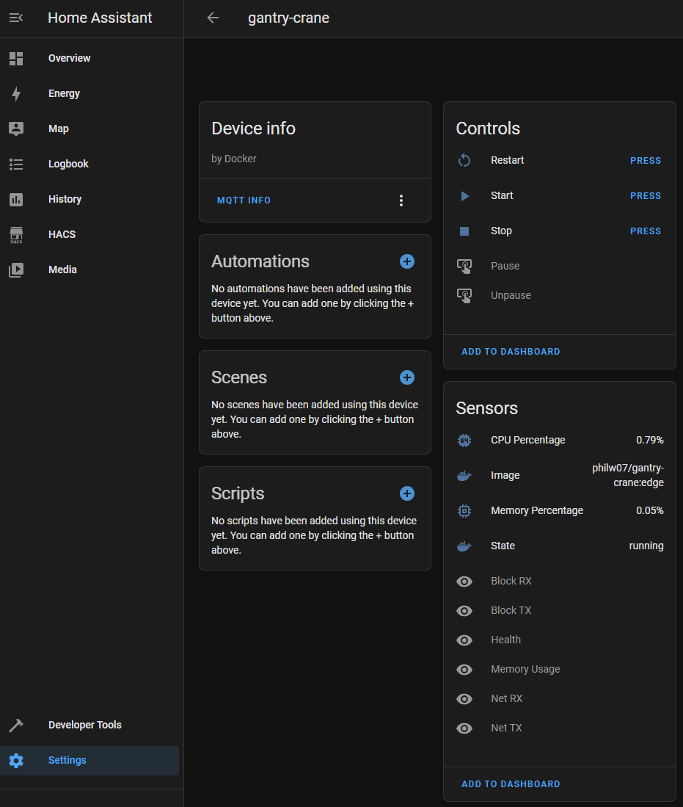

# gantry-crane 🏗️

[](https://github.com/philw07/gantry-crane/actions/workflows/ci.yml)
[](https://github.com/philw07/gantry-crane/actions/workflows/docker.yml)
[](https://deps.rs/repo/github/philw07/gantry-crane)
[](https://github.com/philw07/gantry-crane/blob/master/LICENSE)

A Docker to MQTT bridge which publishes information about your containers for other software to consume and allows to control them.  
Comes with a built-in [Home Assistant](https://www.home-assistant.io/) integration to monitor and control your containers right within Home Assistant.

## Getting started

It's recommended to run this app using docker.
Note that it's required to mount the docker socket into the container.

### Using docker

`docker run -d --name gantry-crane --restart=always -v /var/run/docker.sock:/var/run/docker.sock philw07/gantry-crane:latest`

or

`docker run -d --name gantry-crane --restart=always -v /var/run/docker.sock:/var/run/docker.sock ghcr.io/philw07/gantry-crane:latest`

### Using docker-compose

```
version: "3.5"

services:
  gantry-crane:
    image: philw07/gantry-crane:latest # or ghcr.io/philw07/gantry-crane:latest
    container_name: gantry-crane
    restart: always
    volumes:
      - /var/run/docker.sock:/var/run/docker.sock
```

## Configuration

The recommended way it to use environment variables for configuration.
Alternatively, a `gantry-crane.toml` file can be used (refer to [gantry-crane.example.toml](gantry-crane.example.toml)),
in which case the location of the file should be passed as argument `--config path/to/gantry-crane.toml`.

| Environment variable | Default value | Description |
| --- | --- | --- |
| `POLL_INTERVAL` | 60 | Interval in which all containers will be polled for their current status and updated on MQTT (in seconds). |
| `FILTER_BY_LABEL` | false | [Select which containers should be monitored](#select-containers-to-monitor). |
| `MQTT_HOST` | localhost | The host running the MQTT broker. |
| `MQTT_PORT` | 1883 | The port the MQTT broker listens to. |
| `MQTT_USERNAME` | None | MQTT username, only needed if the broker requires authentication.  |
| `MQTT_PASSWORD` | None | MQTT password, only needed if the broker requires authentication. |
| `MQTT_CLIENT_ID` | gantry-crane | MQTT client ID, should only be changed if two instances connect to the same broker. |
| `MQTT_BASE_TOPIC` | gantry-crane | Base topic under which all information is published. Should only be changed if two instances connect to the same broker. |
| `HOMEASSISTANT_ACTIVE` | false | Set to true to enable the Home Assistant integration. |
| `HOMEASSISTANT_BASE_TOPIC` | homeassistant | Must match the [discovery prefix set in Home Assistant](https://www.home-assistant.io/docs/mqtt/discovery/#discovery_prefix). |
| `HOMEASSISTANT_NODE_ID` | gantry-crane | The [node id](https://www.home-assistant.io/docs/mqtt/discovery/#discovery-topic) used for Home Assistant MQTT discovery. Should only be changed if two instances connect to the same broker. |

## Select containers to monitor

<!-- TODO: describe usage of labels to filter containers -->

By default, gantry-crane bridges all containers to MQTT.
This might not be desirable, especially if you have a large amount of containers.

If you enable the `FILTER_BY_LABEL` setting, you can select which containers should be monitored by giving them the label `gantry-crane.enable=true`.
This can be done via [docker](https://docs.docker.com/engine/reference/commandline/run/#set-metadata-on-container--l---label---label-file) or [docker-compose](https://docs.docker.com/compose/compose-file/compose-file-v3/#labels).

## Home Assistant integration

When enabling the Home Assistant integration, by setting `HOMEASSISTANT_ACTIVE` to true, gantry-crane will publish MQTT discovery topics which Home Assistant will pick up automatically and add each container as a device with several entities (sensors and buttons).
Some entities are disabled by default and can be enabled via the Home Assistant UI.

The sensors and buttons can be used in automations or scenes, e.g. to start/stop containers at a specific time.


